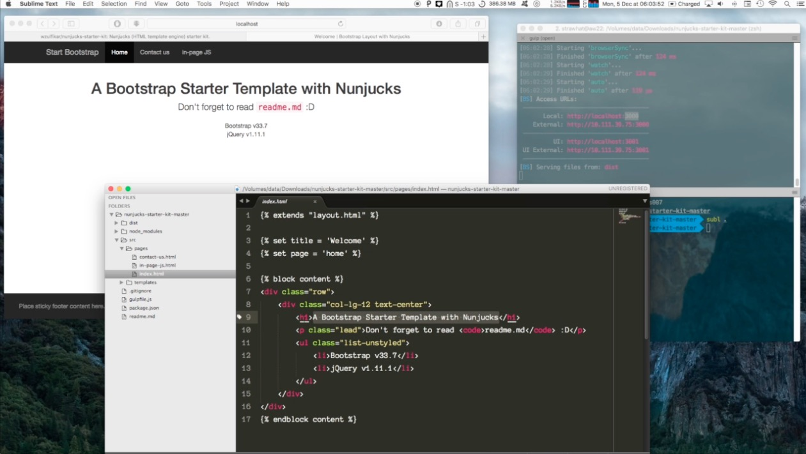

# Nunjucks Starter Kit

## Requirement
- Node: [https://nodejs.org/en/download](https://nodejs.org/en/download) 

---
Use node version 11.xx.xx

### CHECK: `node -v`

If you run node 12.xx.xx or later:
- run `npm install -g n` to install 'n' to manage node versions
- run `n 11.15.0` to install and use node version 11.15.0

### How to start
1. download & unzip: [https://github.com/wzulfikar/nunjucks-starter-kit/archive/master.zip](https://github.com/wzulfikar/nunjucks-starter-kit/archive/master.zip)
- install dependencies: run `npm install`
- run `gulp`
- try change something inside `obj/pages` or `obj/templates` and your browser will auto-reload, displaying the change you just made.

See YouTube video: [https://youtu.be/H7_yhCvQJDk](https://youtu.be/H7_yhCvQJDk)

---

# Why?
- works out of the box! 
- example included (using bootstrap css): 
  - `obj/pages` for page content
  - `obj/templates` for page layout
- output is plain html (stored in `bin` directory)
- serverless
- can use free service like surge.sh, github pages for hosting
- minimum knowledge needed: html, css, js – no need for php, ruby, etc.

## Directory Layout
Here is the project structure:

- `bin` : this directory contains real files that will be hosted
- `bin/css` : compiled scss file as style.css
- `obj` : raw files used to develop the app
- `obj/pages` : pages for the app, everything here will be rendered to `bin` directory
- `obj/templates` : layout files
- `obj/templates/partials` : partial files like nav, user-tabs, menu, etc

## Sample workflow
A. without auto-render

1. edit pages in src
- run `gulp`
- publish `bin` to hosting provider

B. with auto-render

1. run `gulp watch`
- as you edit src, dist gulp watch will do the rendering behind the scene n updates dist directory: you need to reload your browser to see the changes
- publish `bin` to hosting provider

C. with auto-render & auto-reload (via browsersync)

1. run `gulp`
- it will open `http://localhost:3000` in your browser
- using this workflow, when you edit `obj` the `bin` will be updated (just like workflow B) and your browser (`http://localhost:3000`) will be reloaded automatically.

---

Nunjucks official docs: [https://mozilla.github.io/nunjucks]([https://mozilla.github.io/nunjucks)
